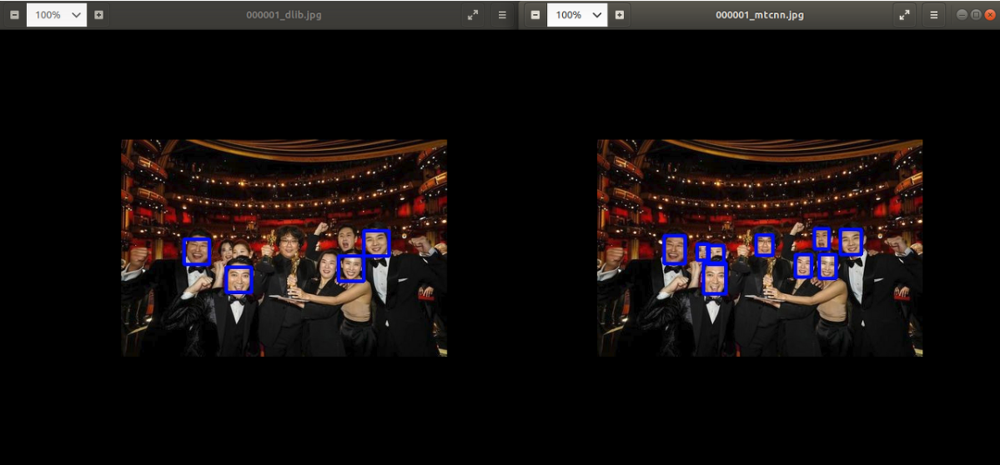

# usePython2AI

I wrote this code that I made during the project(2021.03-2021.06) related to ai.  
I would like to make document as it will be useful later.  


## 1. faceDetection_dlib

### 1-1) face detection_test.py
I want to check about dlib versus mtcnn. mtcnn won this time. mtcnn can detect side view of face.

```
[argument]
--img_path : input image path 
--save_path : output image path
--model : dlib/mtcnn

[how to test]
* dlib
$ python 01_faceDetection/face_detection.py

* mtcnn
$ python 01_faceDetection/face_detection.py --model mtcnn
```

<br>
    
This is the result of 'dlib vs mtcnn'
  



### 1-2) face_detection_save_landmark.py
I use this code to execute 3d face reconstruction. This detects people face using dlib or mtcnn.This find 5 landmarks and save to txt file.  
 
 
 
```
[argument]
--img_path : input image path 
--save_path : output image path
--opt : train/ test
--model : dlib/mtcnn
```
   
    
```
$ python 001_faceDetection/face_detection_save_landmark.py
```
  
## 2. drawing_output
This is useful to drawing bounding box and label. I use this when I execute project which related to MoT(Multiple object Tracking).  

It can drawing bounding box and label with openCV, and it make frame to video in last code with ffmpeg.   
  
--> It will be extended to use argument  
  
    
```
[txt file structure]
* col 0 : frame_num
* col 1 : label
* col 2, col 3, col 4, col 5 : bounding box coord.
* col 6 : confidence score
```
  
  
```
$ python 002_drawing_output/draw.py
```
  
   
## 3. video2frame
This convert video to frame with openCV. After converting, this can resize (1920 x 1080). It can modify whatever you want. 
 
 
--> It will be extended to use argument   
  
    
```
$ python 003_video2frame/video2frame.py
```
  
  
## 4. labelModify
I use this code when I executed mot-neural-solver. This make the first column 1 and transform datatypes of several columns using DataFrames.
   
   
--> It will be extended to use argument  
```
$ python 004_labelModify/labelremove.py 
```
  
  
   
## 5. DetectronDemo2txt.py
I modify detectron2 demo.py file because of saving. Because the existing one was only shown and not stored, this code is modified to save bounding box information and use it to perform MoT.  
If you put the video input path, you can get bounding box coord. for txt file. 
  
  
```
[argument]
--video-input : path to video file 
```


```
[txt file structure]
* col 0 : frame_num
* col 1 : label
* col 2, col 3, col 4, col 5 : bounding box coord.
* col 6 : confidence score
```
  
  
```
$ python 005_detectronDemo2txt.py --video-input own_input_path
```
